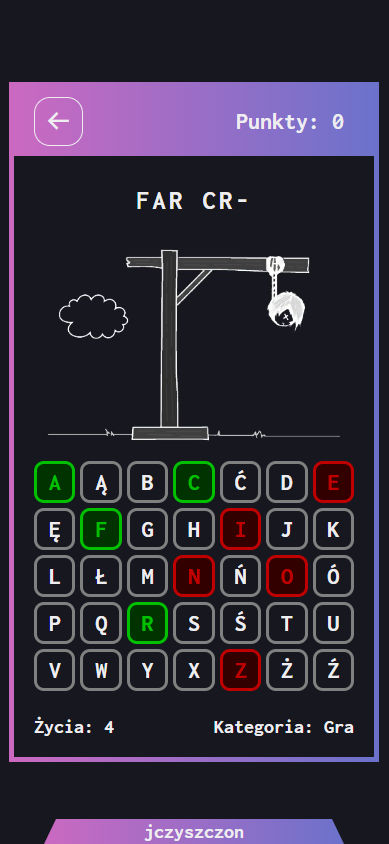

# Hangman Game

It is a simple game developed as part of learning JavaScript.

<table>
        <tr>
            <td>
                
            </td>
            <td>
                
            </td>
        </tr>
</table>

Table of contents

-   [Overview](#overview)
    -   [Main Information](#main-information)
    -   [Screenshots](#screenshots)
    -   [Additional information](#additional-information)
-   [My process](#my-process)
    -   [Built with](#built-with)
    -   [Useful resources](#useful-resources)
-   [Author](#author)

## Overview

### Main Information

After clicking the start button, users go to the main menu where they can choose from three options regarding the password category or go to the settings section.

In the settings section, they can freely turn up or down the music or turn on / off click sounds, etc.

Player can choose from three categories - titles, characters and proverbs. Each category has its own subcategories. For example, the category "title" - has 3 subcategories - titles of games, movies and series. The task is to guess the password. The user starts with 9 lives. For each wrong letter he guesses, he loses one life. If he loses all lives, his score is reset to zero. After guessing the password, his score increase by one.

### Screenshots

<table>
        <tr>
            <td>
                
                
                
                
            </td>
            <td>
                
                
                
                
            </td>
        </tr>
</table>

### Additional Information

The hangman game is connected to the mySQL database from which passwords are randomized, based on the options selected by the player.

Game uses local storage and session storage to save the current score of a player or his settings for music and sounds. It also keeps track of which section in the game the player is in, so that after refreshing the page, the user does not have to go through the sections again.

<table>
        <tr>
            <td>
                
            </td>
            <td>
                
            </td>
        </tr>
</table>

## My process

### Built with

-   JavaScript
-   PHP
-   MySQL Database
-   CSS custom properties
-   Flexbox

(<a href="#top">back to top</a>)

### Useful resources

-   [PHP to JS](https://stackoverflow.com/questions/23740548/how-do-i-pass-variables-and-data-from-php-to-javascript)
-   [Local Storage](https://developer.mozilla.org/en-US/docs/Web/API/Window/localStorage)
-   [Session Storage](https://developer.mozilla.org/en-US/docs/Web/API/Window/sessionStorage)

(<a href="#top">back to top</a>)

## Author

-   Frontend Mentor - [link](https://www.frontendmentor.io/profile/JCzyszczon)
-   Live Page - [link](https://jczyszczon.github.io) - Soon!

(<a href="#top">back to top</a>)

